# Antigravity Dashboard v2.0 🚀

## UI Architecture Diagram (Mermaid)

```mermaid
graph TD
    A[dashboard.py] --> B[Critical Status Bar]
    A --> C[Risk Management Tab]
    A --> D[AI & Strategies Tab]
    A --> E[Market Data Tab]
    A --> F[Portfolio & Signals Tab]

    B --> B1[Trading Mode: Normal/Recovery/Emergency]
    B --> B2[Equity Gauge: Real-time Ratio]
    B --> B3[Alerts Ticker: Signal History]

    C --> C1[Cascade Flowchart: Protective Levels]
    C --> C2[Daily Loss Progress: Dynamic Limit]
    C --> C3[Position Risk Matrix: SL/TS Distances]

    D --> D1[AI Prediction Performance: Conf Trends]
    D --> D2[Confidence Distribution: Acceptance Zone]
    D --> D3[Feature Importance: AI Explainability]
    D --> D4[On-chain Indicators: Netflow/MVRV]

    E --> E1[Current Regimes: Per Symbol]
    E --> E2[Regime Timeline: Shift History]
    E --> E3[ADX & Volatility Dynamics]

    F --> F1[Daily P&L Waterfall: Profit Path]
    F --> F2[Signal Flow Sankey: Acceptance Funnel]
    F --> F3[Recent Trade Log: Detailed History]
```

## Testing Checklist ✅

- [ ] **Critical Status Bar**: Verify mode changes automatically based on `equity_ratio` (50% Emergency, 80% Recovery).
- [ ] **Sticky Header**: Ensure the top bar stays visible during scrolling.
- [ ] **Equity Gauge**: Check that it matches Bybit's real-time wallet balance + unrealized PnL.
- [ ] **Cascade Stops**: Confirm statuses (Triggered/Active/Standby) reflect the current bot state.
- [ ] **Risk Matrix**: Verify "SL Distance" color changes (Red < 1%, Yellow < 3%, Green > 3%).
- [ ] **AI Performance**: Ensure charts render correctly when the `predictions` table is populated.
- [ ] **Feature Importance**: Check that Top 10 features are extracted from `storage/ai_model.joblib`.
- [ ] **On-chain Indicators**: Verify fallback messages appear if `GLASSNODE_API_KEY` is missing.
- [ ] **Regime Timeline**: Confirm that `market_regime_history` is being populated and displayed.
- [ ] **P&L Waterfall**: Check that today's trades are correctly bucketed and visualized.
- [ ] **Sankey Diagram**: Ensure "AI Filter", "Risk Manager", and "Router" rejections are correctly categorized.
- [ ] **Auto-Refresh**: Confirm the page reloads at the selected interval without losing scroll position.
- [ ] **Responsiveness**: Test on different viewport sizes (Mobile/Tablet/Desktop).

## Troubleshooting

- **Empty Database**: The dashboard will show informative "Waiting for data" messages instead of mock data (as per requirement).
- **Missing Model**: If `storage/ai_model.joblib` is missing, the Feature Importance section will show a warning.
- **API Errors**: Bybit API connectivity is tested in the "Diagnostics" section under the "Settings" tab.
