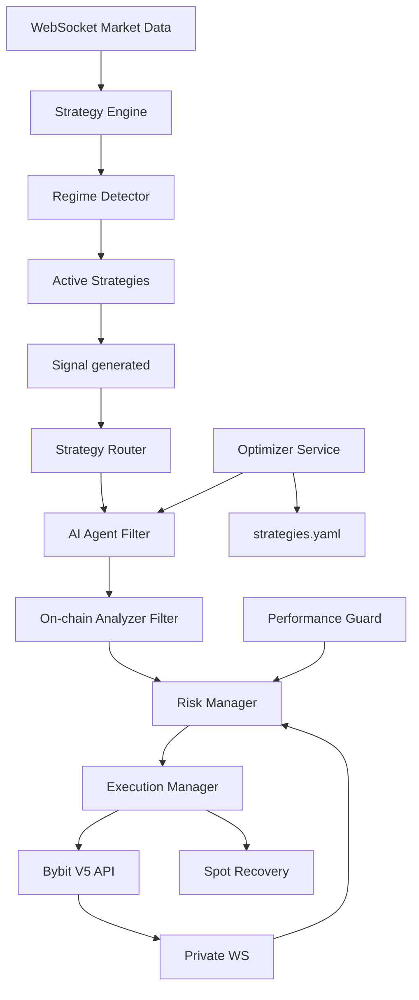

```mermaid
graph TD
    MarketData[WebSocket Market Data] --> Engine[Strategy Engine]
    Engine --> RegimeDetector[Regime Detector]
    RegimeDetector --> Strategy[Active Strategies]
    Strategy --> Signal[Signal generated]
    Signal --> Router[Strategy Router]
    Router --> AIAgent[AI Agent Filter]
    AIAgent --> Onchain[On-chain Analyzer Filter]
    Onchain --> Risk[Risk Manager]
    Risk --> Executor[Execution Manager]
    Executor --> Bybit[Bybit V5 API]
    Executor --> SpotBroker[Spot Recovery]

    Bybit --> WebSocketPrivate[Private WS]
    WebSocketPrivate --> Risk

    Performance[Performance Guard] --> Risk
    Optimizer[Optimizer Service] --> Config[strategies.yaml]
    Optimizer --> AIAgent
```
