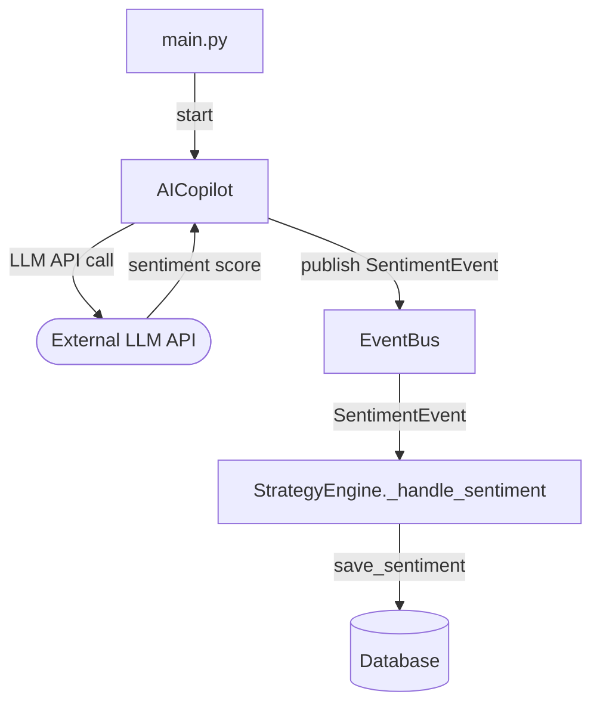

# Module: `antigravity/copilot.py` + `antigravity/ai.py` + `antigravity/ai_agent.py` — AI Layer

## Назначение

Три модуля AI-слоя. `copilot.py` — оркестратор AI-функций (сентимент, советы). `ai.py` — базовая интеграция с LLM (вероятно, OpenAI). `ai_agent.py` — агент с более сложной логикой (возможно, анализ on-chain + сентимент). Результаты публикуются как `SentimentEvent` в `EventBus`.

## Компоненты

| Имя | Тип | Файл | Описание | Входы | Выходы |
|-----|-----|------|----------|-------|--------|
| `AICopilot` | `class` | `copilot.py` | Главный AI-оркестратор | — | `SentimentEvent` → `event_bus` |
| `start()` | `async method` | `copilot.py` | Запускает фоновые AI-задачи | — | — |

> Детали методов `ai.py` и `ai_agent.py` `[UNCLEAR]` — требуют отдельного чтения.

## Связи

**depends_on:**
- `antigravity.event` — `event_bus`, `SentimentEvent`
- `antigravity.logging` — `get_logger`
- Внешний LLM API (вероятно OpenAI) — `[UNCLEAR]`

**used_by:**
- `main.py` — `copilot = AICopilot(); await copilot.start()`
- `antigravity.engine` — потребляет `SentimentEvent` через `event_bus` → `_handle_sentiment`

## Диаграмма

## Примечания

- `[UNCLEAR]`: периодичность запросов к LLM API — риск высоких затрат при частых вызовах
- `[UNCLEAR]`: используется ли `ai_agent.py` напрямую из `copilot.py` или это отдельный путь
- Сентимент сохраняется в БД всегда для BTCUSDT (хардкод в `engine._handle_sentiment`)
- TODO: прочитать `ai.py` и `ai_agent.py` для полной документации
