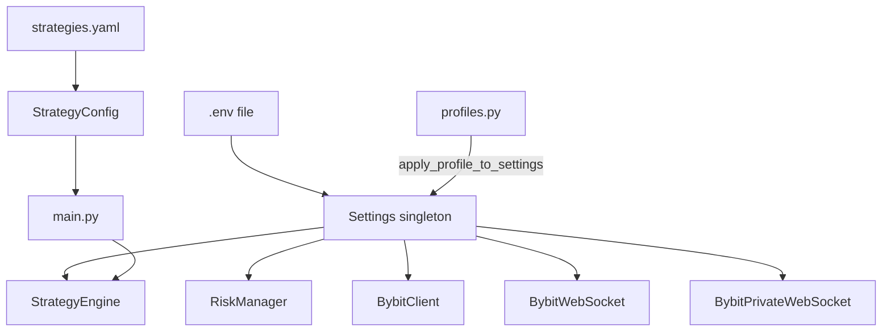

# Module: `antigravity/config.py` + `antigravity/profiles.py` — Configuration

## Назначение

Два взаимосвязанных модуля конфигурации. `config.py` определяет `Settings` (pydantic/dataclass с переменными окружения). `profiles.py` реализует торговые профили (например, `testnet`, `mainnet`, `aggressive`) и накладывает их поверх базовых настроек.

## Компоненты

### `config.py`

| Имя | Тип | Описание |
|-----|-----|----------|
| `Settings` | `class` | Все параметры из `.env`: API keys, symbols, риск-лимиты, флаги фич |
| `settings` | `module-level singleton` | Глобальный экземпляр `Settings` |

**Ключевые поля `Settings` (из `.env.example` и использования в коде):**

| Поле | Описание |
|------|----------|
| `BYBIT_API_KEY` / `BYBIT_API_SECRET` | Ключи Bybit API |
| `TRADING_SYMBOLS` | Список символов для торговли |
| `ACTIVE_STRATEGIES` | Явный список активных стратегий (переопределяет YAML) |
| `ENABLE_ONCHAIN_FILTER` | Флаг on-chain фильтрации |
| `ONCHAIN_BUY_THRESHOLD` / `ONCHAIN_SELL_THRESHOLD` | Пороги on-chain score |
| `DATABASE_URL` | URL базы данных |

### `profiles.py`

| Имя | Тип | Описание | Входы | Выходы |
|-----|-----|----------|-------|--------|
| `get_current_profile()` | `function` | Возвращает активный профиль | — | `Profile` |
| `apply_profile_to_settings()` | `function` | Применяет параметры профиля к `settings` | — | — (side effects: мутирует `settings`) |
| `Profile` | `class/dataclass` | Торговый профиль с полями `name`, `is_testnet`, и переопределениями настроек | — | — |

## Связи

**depends_on:**
- `pydantic` или `python-decouple` / `os.environ`
- `.env` файл

**used_by:**
- Практически все модули `antigravity.*` — через `from antigravity.config import settings`
- `main.py` — `apply_profile_to_settings()`, `settings.TRADING_SYMBOLS`, `settings.ACTIVE_STRATEGIES`

## Диаграмма

## Примечания

- `apply_profile_to_settings()` мутирует глобальный `settings` — нужно вызывать строго до старта всех компонентов (в `main.py` это соблюдается)
- `ACTIVE_STRATEGIES` может быть строкой через запятую или списком — парсинг в `is_strategy_enabled()` в `main.py`
- `.env.example` (3 KB) содержит полный список переменных — рекомендуется использовать как основной справочник параметров
- TODO: добавить валидацию типов для `ACTIVE_STRATEGIES` на уровне `Settings`
