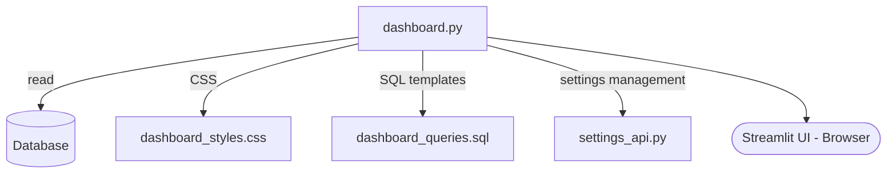

# Module: `dashboard.py` — Streamlit Dashboard

## Назначение

Веб-интерфейс на Streamlit для мониторинга работы бота в реальном времени. Отображает метрики стратегий, историю сигналов, позиции, P&L, on-chain данные. Запускается отдельно от основного бота.

## Компоненты

> Файл 48 KB — полный список `[UNCLEAR]`. Ниже — структура по известным артефактам.

| Имя | Тип | Описание |
|-----|-----|----------|
| `dashboard.py` | `Streamlit app` | Главный файл дашборда |
| `dashboard_styles.css` | `CSS` | Стили интерфейса |
| `dashboard_queries.sql` | `SQL` | Готовые SQL-запросы для виджетов |
| `.streamlit/` | `dir` | Конфигурация Streamlit (theme и т.д.) |

## Связи

**depends_on:**
- `antigravity.database` — `db` (чтение всех данных)
- `antigravity.config` — `settings`
- `streamlit` — UI фреймворк
- `pandas`, `plotly` — визуализация
- `settings_api.py` — управление настройками через UI `[UNCLEAR]`

**used_by:**
- Никем (отдельный процесс, запускается через `streamlit run dashboard.py`)

## Диаграмма

## Примечания

- Запускается независимо от `main.py` — два разных процесса, связь только через общую БД
- `settings_api.py` (8 KB) вероятно позволяет менять настройки бота через дашборд в реальном времени — `[UNCLEAR]` механизм применения изменений
- `dashboard_queries.sql` — признак сложных аналитических запросов (агрегации, оконные функции)
- TODO: проверить, нет ли race condition при одновременной записи `main.py` и чтении `dashboard.py`
