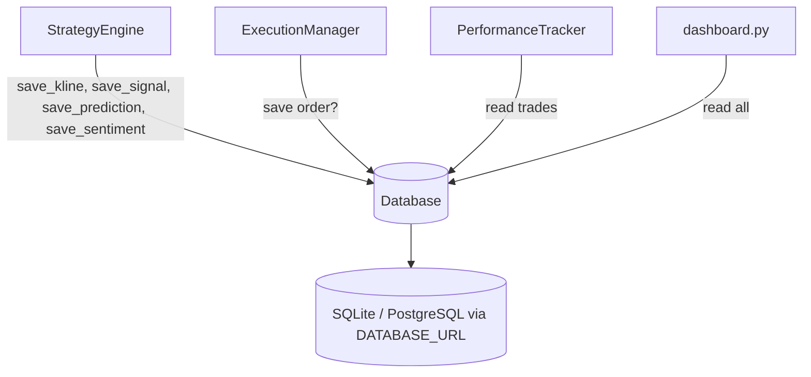

# Module: `antigravity/database.py` — Database Layer

## Назначение

Уровень персистентности данных на SQLAlchemy. Сохраняет klines, сигналы, позиции, сентимент, ML-предсказания. Предоставляет глобальный singleton `db` для всего приложения.

## Компоненты

| Имя | Тип | Описание | Входы | Выходы |
|-----|-----|----------|-------|--------|
| `Database` | `class` | ORM-обёртка над SQLAlchemy | — | — |
| `save_kline(symbol, interval, o, h, l, c, v, ts)` | `method` | Сохраняет свечу | `str, str, float×5, int` | — |
| `save_signal(strategy, symbol, type, price, reason)` | `method` | Сохраняет сигнал (принятый / отклонённый) | `str, str, str, float, str` | — |
| `save_prediction(symbol, prediction_value, confidence, features)` | `method` | Сохраняет ML-предсказание | `str, float, float, dict` | — |
| `save_sentiment(symbol, score, reasoning, model)` | `method` | Сохраняет AI-сентимент | `str, float, str, str` | — |
| `engine` | `property` | SQLAlchemy engine для `pd.read_sql` | — | `Engine` |
| `db` | `module-level singleton` | Глобальный экземпляр `Database` | — | — |

> Полный список методов `[UNCLEAR]` — файл 11 KB, вероятно содержит также методы чтения позиций и сделок.

## Связи

**depends_on:**
- SQLAlchemy
- `antigravity.config` — `settings` (DATABASE_URL)
- `antigravity.logging` — `get_logger`

**used_by:**
- `antigravity.engine` — `save_kline`, `save_signal`, `save_prediction`, `save_sentiment`, `pd.read_sql(db.engine)`
- `antigravity.execution` — предположительно сохранение ордеров `[UNCLEAR]`
- `antigravity.performance_tracker` — чтение истории сделок
- `dashboard.py` — чтение для отображения

## Диаграмма

## Примечания

- В `_warmup_strategies` используется raw SQL f-string без параметризации: `f"SELECT * FROM klines WHERE symbol='{symbol}'"` — **SQL injection уязвимость**
- В `_handle_market_data` уже используется параметризованный `text()` с `params={"symbol": ...}` — непоследовательно
- TODO: унифицировать все SQL-запросы на параметризованный стиль
- `db.engine` напрямую передаётся в `pd.read_sql` — означает синхронное чтение в async-контексте без `run_in_executor`
