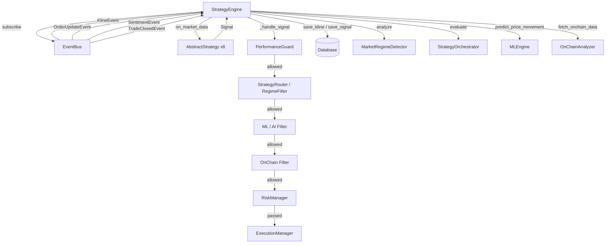

# Module: `antigravity/engine.py` — Strategy Engine

## Назначение

Центральный оркестратор системы. Управляет жизненным циклом стратегий, обрабатывает рыночные события, прогоняет сигналы через многоуровневую фильтрацию (Regime → AI → On-chain → Risk) и передаёт одобренные сигналы в `ExecutionManager`. Хранит глобальный singleton `strategy_engine`.

## Компоненты

| Имя | Тип | Описание | Входы | Выходы |
|-----|-----|----------|-------|--------|
| `StrategyEngine` | `class` | Главный класс-оркестратор | — | — |
| `register_strategy(strategy)` | `method` | Регистрирует стратегию по имени | `AbstractStrategy` | — |
| `start()` | `async method` | Запускает engine, warmup, подписки на события | — | — (side effects: запуск стратегий, on-chain loop) |
| `stop()` | `async method` | Останавливает все стратегии | — | — |
| `_warmup_strategies()` | `async method` | Загружает 300 исторических свечей из БД или API для прогрева индикаторов | — | — (side effects: запись в БД) |
| `_handle_market_data(event)` | `async method` | Обработчик KlineEvent: сохраняет свечу, обновляет режим рынка, запускает ML, рассылает по стратегиям | `MarketDataEvent / KlineEvent` | — |
| `_handle_order_update(event)` | `async method` | Роутинг OrderUpdateEvent к стратегиям по символу | `OrderUpdateEvent` | — |
| `_handle_sentiment(event)` | `async method` | Сохраняет сентимент BTCUSDT в БД | `SentimentEvent` | — |
| `_handle_signal(signal, strategy_name)` | `async method` | Многоуровневая фильтрация сигнала и передача в execution | `Signal`, `str` | — (side effects: запись в БД, вызов execution) |
| `_handle_trade_closed(event)` | `async method` | Обновляет performance guard и метрики при закрытии сделки | `TradeClosedEvent` | — |
| `_onchain_update_loop()` | `async method` | Фоновый цикл обновления on-chain данных каждые 300с | — | — |
| `strategy_engine` | `module-level singleton` | Глобальный экземпляр `StrategyEngine` | — | — |

## Связи

**depends_on:**
- `antigravity.event` — `event_bus`, event types
- `antigravity.strategy` — `AbstractStrategy`, `Signal`, `SignalType`
- `antigravity.risk` — `RiskManager`
- `antigravity.database` — `db`
- `antigravity.execution` — `execution_manager`, `ExecutionRejection`
- `antigravity.ml_engine` — `ml_engine`
- `antigravity.client` — `BybitClient`
- `antigravity.regime_detector` — `market_regime_detector`
- `antigravity.router` — `strategy_router`
- `antigravity.onchain_analyzer` — `onchain_analyzer`
- `antigravity.strategy_orchestrator` — `orchestrator`
- `antigravity.performance_guard` — `performance_guard`
- `antigravity.performance_metrics` — `performance_metrics` (lazy import)
- `antigravity.config` — `settings`

**used_by:**
- `main.py` — регистрация стратегий, запуск/остановка
- `antigravity.websocket_client` — косвенно через `event_bus.publish(KlineEvent)`
- `antigravity.websocket_private` — косвенно через `event_bus.publish(OrderUpdateEvent)`

## Диаграмма

## Примечания

- Сигнал проходит **5 последовательных фильтров** перед исполнением: PerformanceGuard → Regime → AI (confidence > 0.6) → On-chain → Risk
- Прогрев (`_warmup_strategies`) использует raw SQL через `pd.read_sql` — уязвим к SQL-инъекции (параметр `symbol` не экранируется)
- `_handle_sentiment` жёстко прописывает символ `"BTCUSDT"` независимо от источника события — TODO
- `_onchain_update_loop` стартует как asyncio task без явного хранения ссылки — может быть потерян GC
- TODO: хранить ссылку на `_onchain_task` для корректной отмены при `stop()`
