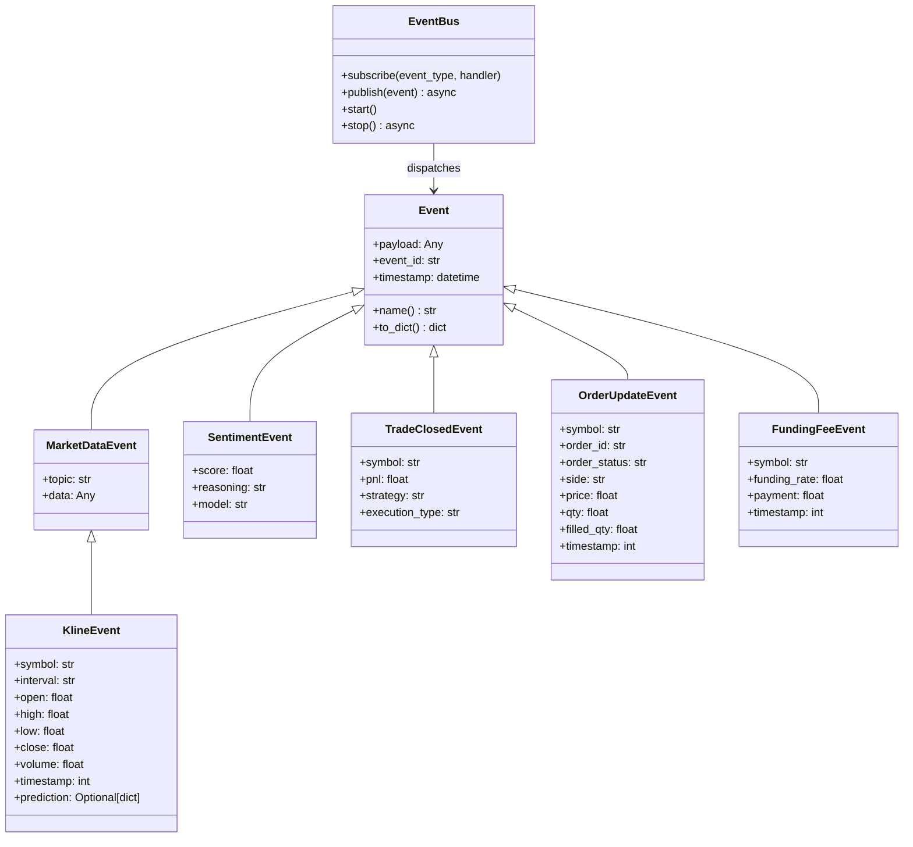

# Module: `antigravity/event.py` — Event Bus

## Назначение

Асинхронная шина событий на базе `asyncio.Queue`. Декаплирует WebSocket-клиентов, стратегии и engine: любой компонент публикует событие, все подписчики получают его асинхронно. Хранит глобальный singleton `event_bus`.

## Компоненты

| Имя | Тип | Описание | Входы | Выходы |
|-----|-----|----------|-------|--------|
| `Event` | `dataclass` | Базовый класс всех событий | `payload`, `event_id`, `timestamp` | `.name`, `.to_dict()` |
| `MarketDataEvent` | `dataclass(Event)` | Обновление рыночных данных (orderbook, trades) | `topic`, `data` | — |
| `KlineEvent` | `dataclass(MarketDataEvent)` | Завершённая свеча | `symbol`, `interval`, `open/high/low/close/volume`, `timestamp`, `prediction` | — |
| `SentimentEvent` | `dataclass(Event)` | Результат AI-анализа сентимента | `score[-1..1]`, `reasoning`, `model` | — |
| `TradeClosedEvent` | `dataclass(Event)` | Закрытая сделка с PnL | `symbol`, `pnl`, `strategy`, `execution_type` | — |
| `FundingFeeEvent` | `dataclass(Event)` | Выплата funding fee | `symbol`, `funding_rate`, `payment`, `timestamp` | — |
| `OrderUpdateEvent` | `dataclass(Event)` | Обновление статуса ордера | `symbol`, `order_id`, `order_status`, `side`, `price`, `qty`, `filled_qty`, `timestamp` | — |
| `EventBus` | `class` | Асинхронная очередь событий | — | — |
| `subscribe(event_type, handler)` | `method` | Регистрирует обработчик | `Type[Event]`, `Callable` | — |
| `publish(event)` | `async method` | Публикует событие в очередь | `Event` | — |
| `start()` | `method` | Запускает фоновый worker | — | — |
| `stop()` | `async method` | Останавливает worker | — | — |
| `event_bus` | `module-level singleton` | Глобальный экземпляр `EventBus` | — | — |
| `on_event(event_type)` | `decorator` | Декоратор подписки функции на тип события | `Type[Event]` | `Callable` |

## Связи

**depends_on:**
- `antigravity.logging` — `get_logger`

**used_by:**
- `antigravity.engine` — подписка и обработка всех типов событий
- `antigravity.websocket_client` — `publish(KlineEvent)`
- `antigravity.websocket_private` — `publish(OrderUpdateEvent)`
- `antigravity.copilot` — `publish(SentimentEvent)` (предположительно)
- `main.py` — `event_bus.start()`, `event_bus.stop()`

## Диаграмма

## Примечания

- Worker обрабатывает события полиморфно: сначала точное совпадение типа, затем проверяет базовые классы — это позволяет подписаться на `MarketDataEvent` и получать `KlineEvent`
- `FundingFeeEvent` определён, но в видимом коде не используется (`[UNCLEAR]` — возможно, используется в `execution.py` или `websocket_private.py`)
- `asyncio.Queue` без ограничения размера — при высокой нагрузке возможен неограниченный рост памяти
- TODO: добавить `maxsize` в `asyncio.Queue` и backpressure-логику
