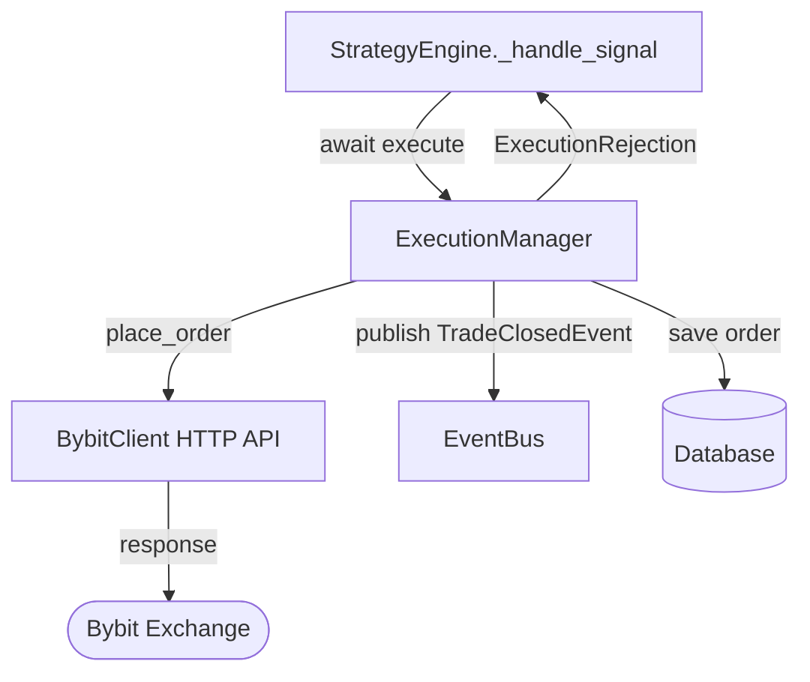

# Module: `antigravity/execution.py` — Execution Manager

## Назначение

Отвечает за размещение ордеров на бирже Bybit через HTTP API. Получает одобренный `Signal` от `StrategyEngine`, вычисляет размер позиции, выставляет ордер, обрабатывает TP/SL. Хранит глобальный singleton `execution_manager`.

## Компоненты

> Файл 37 KB — полный список методов `[UNCLEAR]`. Ниже — интерфейс, известный из использования в `engine.py`.

| Имя | Тип | Описание | Входы | Выходы |
|-----|-----|----------|-------|--------|
| `ExecutionManager` | `class` | Управляет исполнением ордеров | — | — |
| `execute(signal, strategy_name)` | `async method` | Исполняет сигнал: размещает ордер на бирже | `Signal`, `str` | — (side effects: HTTP запрос к Bybit) |
| `ExecutionRejection` | `exception` | Business-level отказ (недостаток средств, спред) | — | — |
| `execution_manager` | `module-level singleton` | Глобальный экземпляр | — | — |

## Связи

**depends_on:**
- `antigravity.client` — `BybitClient` (HTTP API)
- `antigravity.config` — `settings`
- `antigravity.database` — `db`
- `antigravity.logging` — `get_logger`
- `antigravity.fees` — расчёт комиссий
- `antigravity.event` — `event_bus` (публикация `TradeClosedEvent`)

**used_by:**
- `antigravity.engine` — `execution_manager.execute(signal, strategy_name)`

## Диаграмма

## Примечания

- `ExecutionRejection` — кастомное исключение для business-level отказов (перехватывается в `engine._handle_signal`)
- Непредвиденные технические ошибки тоже перехватываются в engine, так что `execute()` не должен крашить систему
- Файл 37 KB — вероятно содержит логику: precision rounding (есть отдельный `check_precision.py`), retry-логику, TP/SL выставление
- `[UNCLEAR]`: публикует ли `execution_manager` `TradeClosedEvent` самостоятельно или это делает другой компонент
- TODO: детальный анализ файла для документирования всех внутренних методов
