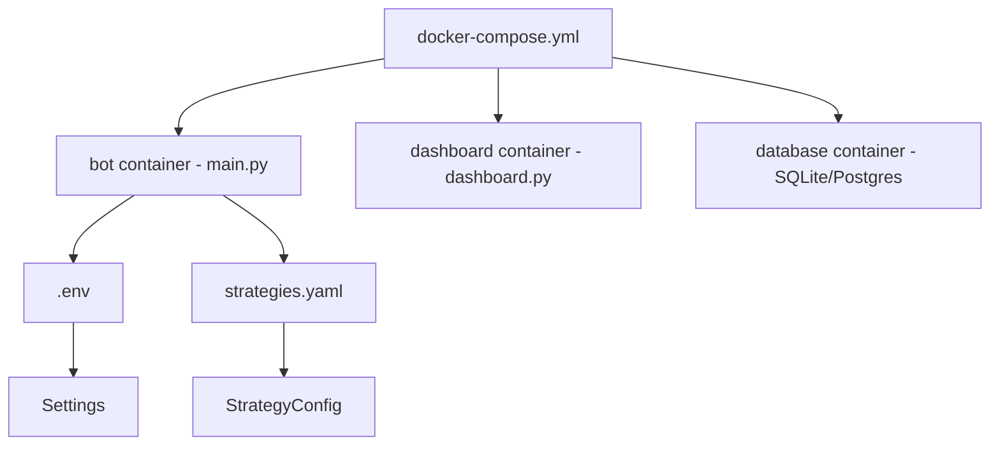

# Module: Infrastructure — Docker + Config Files

## Назначение

Инфраструктурный слой: контейнеризация через Docker, конфигурация стратегий через YAML, вспомогательные скрипты. Обеспечивает воспроизводимое окружение для деплоя бота и дашборда.

## Компоненты

| Файл | Тип | Описание |
|------|-----|----------|
| `Dockerfile` | Docker | Образ для основного бота |
| `docker-compose.yml` | Docker Compose | Оркестрация сервисов (bot + dashboard + db) |
| `docker-compose.override.yml` | Docker Compose | Переопределения для локальной разработки |
| `strategies.yaml` | YAML | Конфигурация стратегий: параметры индикаторов, enabled-флаги |
| `requirements.txt` | Pip | Python-зависимости |
| `.env.example` | Env template | Шаблон переменных окружения |
| `scripts/` | dir | Вспомогательные скрипты `[UNCLEAR содержимое]` |
| `storage/` | dir | Хранилище данных (БД файлы) `[UNCLEAR]` |
| `patches/` | dir | Патчи `[UNCLEAR]` |
| `temp_modifications/` | dir | Временные модификации `[UNCLEAR]` |

### `strategies.yaml` — структура

```yaml
# Пример структуры (из load_strategy_config)
trend_following:
  enabled: true
  # параметры EMA, MACD...
mean_reversion:
  enabled: true
  # параметры RSI, BB...
volatility_breakout:
  enabled: false
# ... и т.д. для каждой стратегии
```

## Связи

**depends_on:**
- `antigravity.strategies.config` читает `strategies.yaml` через `load_strategy_config()`
- `antigravity.config` читает `.env`

**used_by:**
- `main.py` — `load_strategy_config("strategies.yaml")`
- Docker Compose — оркестрация всех сервисов

## Диаграмма



## Примечания

- `temp_modifications/` и `patches/` — нестандартные директории, вероятно hotfix-остатки `[UNCLEAR]`
- `docker-compose.override.yml` (201 байт) — маленький файл, вероятно только переопределяет порты или volume пути
- `requirements.txt` (165 байт) — очень маленький, вероятно не полный список (часть зависимостей может быть implicit)
- TODO: проверить содержимое `scripts/`, `patches/`, `temp_modifications/` на предмет актуальности
