# Module: `main.py` — Entry Point

## Назначение

Точка входа приложения. Инициализирует все компоненты системы: загружает конфиг, регистрирует стратегии, запускает WebSocket-потоки и запускает `StrategyEngine`. Обрабатывает сигналы ОС (`SIGTERM`, `SIGINT`) для корректного завершения.

## Компоненты

| Имя | Тип | Описание | Входы | Выходы |
|-----|-----|----------|-------|--------|
| `main()` | `async function` | Главная корутина запуска системы | — | — (side effects: запуск engine, WS, copilot) |
| `shutdown(signal, loop)` | `async function` | Корректная остановка всех задач и websocket-клиентов | `signal`, `loop` | — (side effects: cancel tasks, stop engine/event_bus) |
| `is_strategy_enabled(strategy_config, yaml_key, env_names)` | `function` | Определяет, должна ли стратегия быть активной | `strategy_config`, `yaml_key`, `env_names: list[str]` | `bool` |
| `ws_client` | `global var` | Ссылка на публичный WebSocket-клиент | — | — |
| `ws_private_client` | `global var` | Ссылка на приватный WebSocket-клиент | — | — |

## Связи

**depends_on:**
- `antigravity.logging` — `configure_logging`, `get_logger`
- `antigravity.engine` — `strategy_engine`
- `antigravity.event` — `event_bus`
- `antigravity.copilot` — `AICopilot`
- `antigravity.websocket_client` — `BybitWebSocket`
- `antigravity.websocket_private` — `BybitPrivateWebSocket`
- `antigravity.strategies.config` — `load_strategy_config`
- `antigravity.config` — `settings`
- `antigravity.profiles` — `get_current_profile`, `apply_profile_to_settings`
- `antigravity.strategies.*` — 8 классов стратегий

**used_by:**
- Никем (это точка входа — запускается напрямую)

## Диаграмма

```mermaid
graph TD
    MAIN[main.py] --> LOGGING[antigravity.logging]
    MAIN --> CONFIG[antigravity.config / settings]
    MAIN --> PROFILES[antigravity.profiles]
    MAIN --> STRAT_CFG[antigravity.strategies.config]
    MAIN --> ENGINE[antigravity.engine / strategy_engine]
    MAIN --> EVENTBUS[antigravity.event / event_bus]
    MAIN --> COPILOT[antigravity.copilot / AICopilot]
    MAIN --> WS_PUB[antigravity.websocket_client / BybitWebSocket]
    MAIN --> WS_PRIV[antigravity.websocket_private / BybitPrivateWebSocket]
    MAIN --> S1[strategies.trend_improved / GoldenCrossImproved]
    MAIN --> S2[strategies.mean_reversion_improved / BollingerRSIImproved]
    MAIN --> S3[strategies.volatility / VolatilityBreakoutStrategy]
    MAIN --> S4[strategies.scalping / ScalpingStrategy]
    MAIN --> S5[strategies.bb_squeeze / BBSqueezeStrategy]
    MAIN --> S6[strategies.grid_improved / GridMasterImproved]
    MAIN --> S7[strategies.dynamic_risk_leverage / DynamicRiskLeverageStrategy]
    MAIN --> S8[strategies.spot_recovery / SpotRecoveryStrategy]
    ENGINE --> S1 & S2 & S3 & S4 & S5 & S6 & S7 & S8
```

## Примечания

- `is_strategy_enabled` имеет двухуровневый приоритет: `ACTIVE_STRATEGIES` из `.env` переопределяет `enabled` из `strategies.yaml`
- `SpotRecoveryStrategy` регистрируется **всегда** без проверки флага enabled
- WebSocket темы для публичного потока формируются как `kline.1.{symbol}` для каждого символа из `settings.TRADING_SYMBOLS`
- Глобальные переменные `ws_client`, `ws_task`, `ws_private_client`, `ws_private_task` — это потенциальный anti-pattern; используются для доступа из `shutdown()`
- TODO: рассмотреть инкапсуляцию глобального состояния в класс Application
