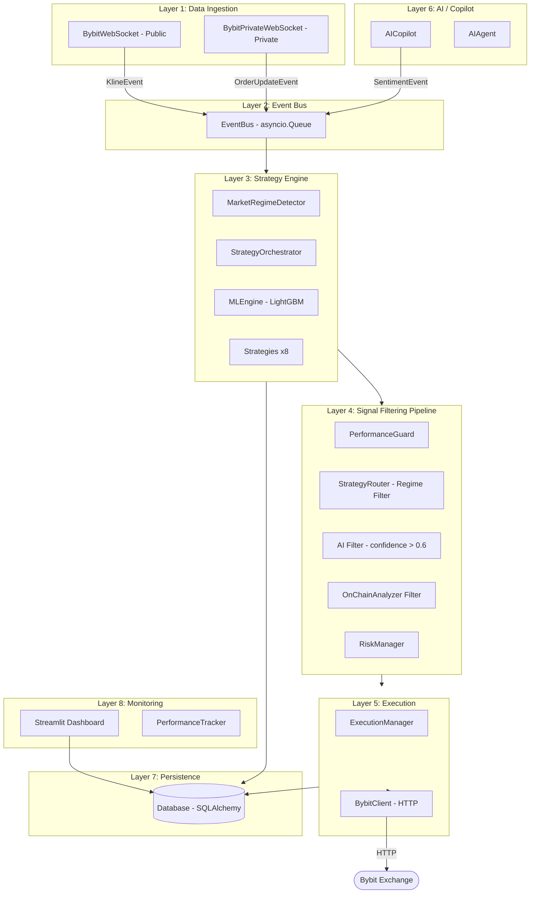

# Cryptobot — Общий Архитектурный Обзор

## Назначение

Автоматический торговый бот для биржи Bybit (деривативы/фьючерсы). Реализует многостратегийную архитектуру с event-driven ядром, многоуровневой AI/ML фильтрацией сигналов, риск-менеджментом и Streamlit-дашбордом для мониторинга.

## Архитектурные слои

## Ключевые паттерны

| Паттерн | Где используется |
|---------|------------------|
| **Event-Driven Architecture** | `EventBus` — декаплинг всех компонентов |
| **Strategy Pattern** | `AbstractStrategy` + 8 реализаций |
| **Chain of Responsibility** | 5-уровневая фильтрация сигналов в `engine._handle_signal` |
| **Singleton** | `strategy_engine`, `event_bus`, `db`, `ml_engine`, `execution_manager` |
| **Observer** | `event_bus.subscribe()` + `on_event()` decorator |
| **Template Method** | `AbstractStrategy.on_market_data()` как шаблон |

## Карта файлов документации

| Файл | Модуль |
|------|--------|
| `full-project-main-note.md` | `main.py` |
| `full-project-engine-note.md` | `antigravity/engine.py` |
| `full-project-event-note.md` | `antigravity/event.py` |
| `full-project-strategies-note.md` | `antigravity/strategies/` |
| `full-project-websocket-note.md` | `antigravity/websocket_client.py` + `websocket_private.py` |
| `full-project-risk-note.md` | `antigravity/risk.py` |
| `full-project-database-note.md` | `antigravity/database.py` |
| `full-project-config-note.md` | `antigravity/config.py` + `profiles.py` |
| `full-project-execution-note.md` | `antigravity/execution.py` |
| `full-project-ai-copilot-note.md` | `antigravity/copilot.py` + `ai.py` + `ai_agent.py` |
| `full-project-dashboard-note.md` | `dashboard.py` |
| `full-project-infrastructure-note.md` | Docker + YAML + scripts |

## Критические связи (точки интеграции)

1. **EventBus** — центральная точка интеграции всех компонентов; деградация нарушает весь data flow
2. **`engine._handle_signal()`** — критический путь от сигнала до ордера; 5 последовательных фильтров
3. **`db` singleton** — разделяется между `main.py` (запись) и `dashboard.py` (чтение); нет явного connection pooling
4. **`settings` singleton** — мутируется через `apply_profile_to_settings()`; должен применяться до старта компонентов

## Открытые вопросы `[UNCLEAR]`

- Механизм reconnect WebSocket при потере соединения
- Полный публичный API `RiskManager` и `ExecutionManager` (крупные файлы)
- Назначение `patches/`, `temp_modifications/`, `scripts/`
- Используются ли `macd.py`, `rsi.py` из `strategies/`
- Как `settings_api.py` применяет изменения к живому боту
