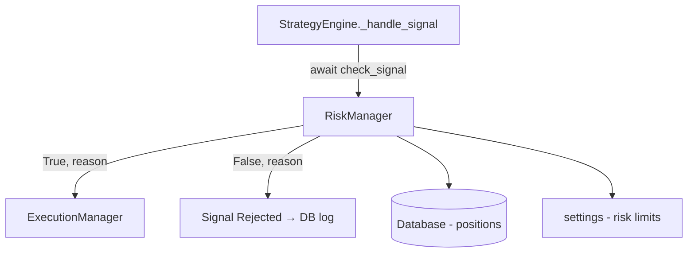

# Module: `antigravity/risk.py` — Risk Manager

## Назначение

Центральный модуль управления рисками. Проверяет каждый сигнал перед исполнением: лимиты позиций, максимальные убытки, размер ставки. Является 4-м (последним) фильтром в цепочке `_handle_signal` движка.

## Компоненты

| Имя | Тип | Описание | Входы | Выходы |
|-----|-----|----------|-------|--------|
| `RiskManager` | `class` | Главный класс риск-менеджера | — | — |
| `check_signal(signal)` | `async method` | Проверяет сигнал на соответствие риск-лимитам | `Signal` | `tuple[bool, str]` — (passed, reason) |

> Полный список методов `[UNCLEAR]` — файл 28 KB, детальный анализ требует отдельного чтения. Ниже — структура на основе использования в `engine.py`.

## Связи

**depends_on:**
- `antigravity.config` — `settings` (лимиты риска)
- `antigravity.database` — `db` (текущие позиции)
- `antigravity.client` — `BybitClient` (баланс счёта)
- `antigravity.logging` — `get_logger`

**used_by:**
- `antigravity.engine` — `RiskManager.check_signal(signal)` в `_handle_signal()`

## Диаграмма

## Примечания

- Файл 28 KB — вероятно содержит сложную логику: position sizing, drawdown limits, correlation checks
- `[UNCLEAR]`: полный список публичных методов требует отдельного прочтения файла
- Потенциальное дублирование с `DynamicRiskLeverageStrategy` (26 KB) — та стратегия также управляет плечом и рисками на уровне стратегии
- TODO: проверить, нет ли конфликта между риск-проверкой в `RiskManager` и внутренней логикой `DynamicRiskLeverageStrategy`
