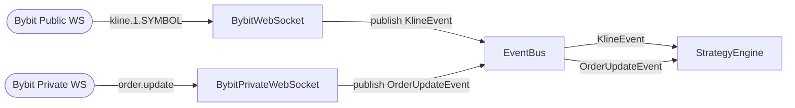

# Module: `antigravity/websocket_client.py` + `websocket_private.py` — WebSocket Feeds

## Назначение

Два WebSocket-клиента для подключения к бирже Bybit. Публичный (`BybitWebSocket`) слушает kline-топики и публикует `KlineEvent` в `EventBus`. Приватный (`BybitPrivateWebSocket`) слушает ордера/исполнения пользователя и публикует `OrderUpdateEvent`.

## Компоненты

| Имя | Тип | Файл | Описание | Входы | Выходы |
|-----|-----|------|----------|-------|--------|
| `BybitWebSocket` | `class` | `websocket_client.py` | Публичный WS-клиент | — | `KlineEvent` → `event_bus` |
| `connect(topics)` | `async method` | `websocket_client.py` | Подключается, подписывается на топики, читает поток | `topics: list[str]` | — (side effects: publish events) |
| `close()` | `async method` | `websocket_client.py` | Закрывает соединение | — | — |
| `BybitPrivateWebSocket` | `class` | `websocket_private.py` | Приватный WS-клиент с аутентификацией | — | `OrderUpdateEvent` → `event_bus` |
| `connect()` | `async method` | `websocket_private.py` | Подключается с HMAC-аутентификацией, слушает ордера | — | — (side effects: publish events) |
| `close()` | `async method` | `websocket_private.py` | Закрывает соединение | — | — |

## Связи

**depends_on:**
- `antigravity.event` — `event_bus`, `KlineEvent`, `OrderUpdateEvent`
- `antigravity.config` — `settings` (URL, API keys)
- `antigravity.auth` — HMAC-подпись для приватного WS
- `antigravity.logging` — `get_logger`

**used_by:**
- `main.py` — инстанцирование, запуск как `asyncio.create_task`, вызов `close()` в `shutdown()`

## Диаграмма

## Примечания

- Топики для публичного потока формируются в `main.py` как `kline.1.{symbol}` (таймфрейм 1 минута жёстко задан)
- Приватный клиент использует HMAC-аутентификацию через `antigravity.auth`
- Оба клиента запускаются как независимые `asyncio.Task` с `done_callback` для логирования ошибок
- При потере соединения поведение reconnect `[UNCLEAR]` — нужна проверка наличия retry-логики внутри файлов
- TODO: добавить автоматический reconnect с экспоненциальным backoff
